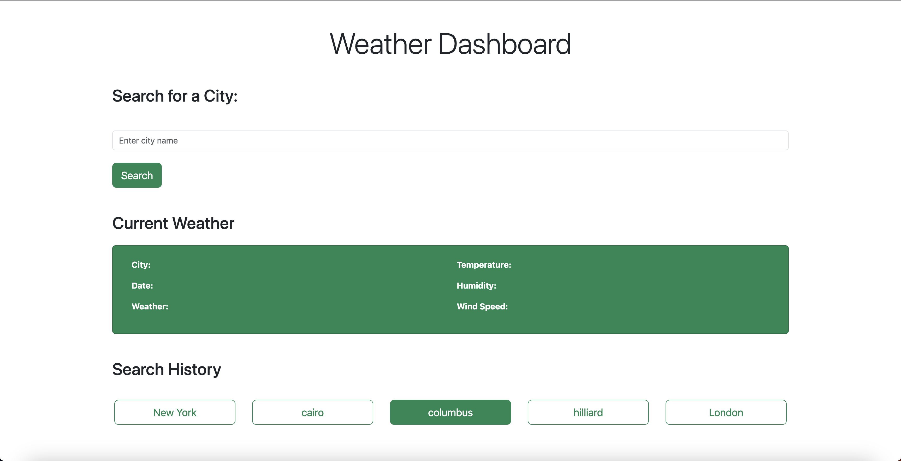
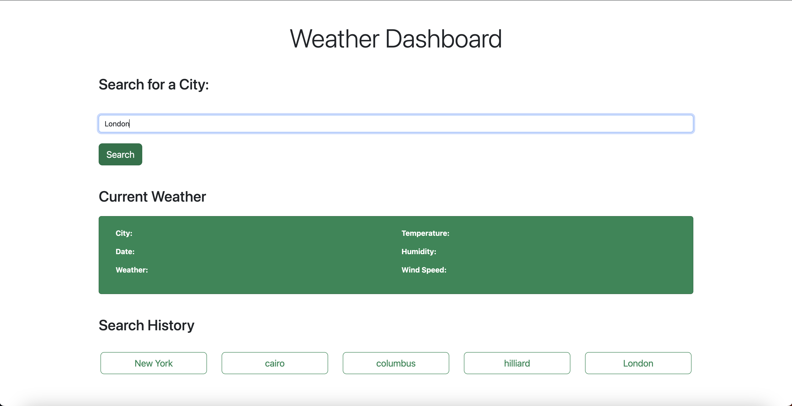
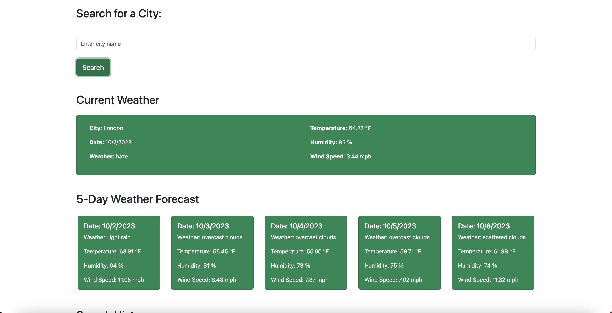
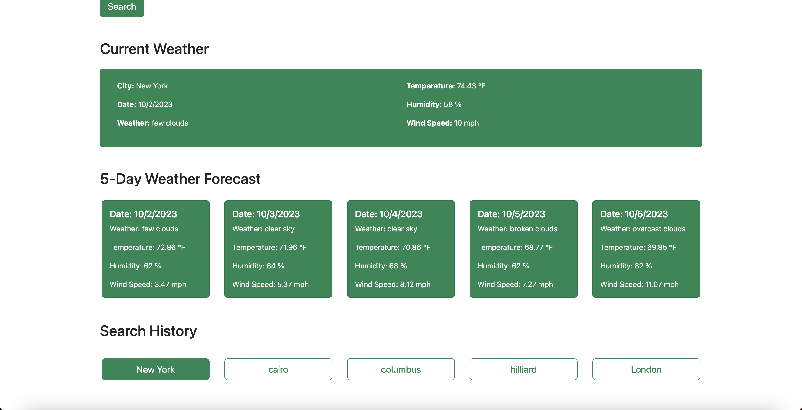

# Weather-Dashboard

## Description

Weather Dashboard is a simple web application that allows users to search for the current weather and a 5-day weather forecast for a specific city. It also keeps a history of past searches.

## Features

- Search for the current weather and 5-day weather forecast by entering a city name.
- View current weather details, including temperature, humidity, and wind speed.
- See a 5-day weather forecast with date, weather description, temperature, humidity, and wind speed for each day.
- Keep a search history of past city searches.
- Click on a past city search to view its weather information again.

## Usage

Included screenshots shows the usage and the deployed URL.

[Weather Dashboard]()
